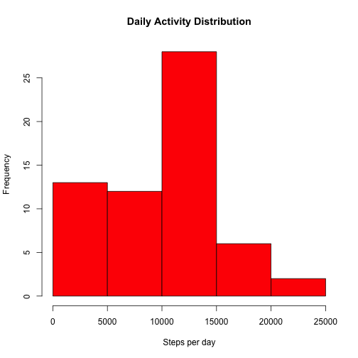

# Reproducible Research: Peer Assessment 1

```r
opts_chunk$set(echo = TRUE)
```
## Loading and preprocessing the data

```r
DF <- read.csv("activity.csv", header = TRUE, sep = ",", stringsAsFactors=FALSE, na.strings="NA")
colnames(DF)[2] <- "dt1"  
```

## What is mean total number of steps taken per day?

```r
#Calculate the daily steps
    daily<-aggregate(DF$steps, list(DF$dt1), FUN=sum ,na.rm=TRUE)

#histogram
    hist(daily$x, col = "red", main = "Daily Activity Distribution", xlab = "Steps per day")
```

 

```r
#mean and median
    m1 <- mean(daily$x)
    m2 <- median(daily$x)
```
Most subjects walked between 10000 to 15000 steps a day.  
The mean Daily Activity is **9354.2295** steps.  
The median Daily Activity is **10395** steps.  

## What is the average daily activity pattern?

```r
#Calculate the pattern of steps
    Interval<-aggregate(DF$steps, list(DF$interval), FUN=mean ,na.rm=TRUE)

#Plot the timeline graph
    par(bg = "grey")
    par(mar = c(3,4,2,2))
    #plot the graph
    plot(Interval$Group.1, Interval$x , type = "l", ylab = "Pattern", xlab="Interval of day")
```

 

```r
#Find Max Interval
i1 <- Interval[Interval$x==max(Interval$x),1]
i2 <- i1 + 5
```
People walk most between the 5 minute interval of **835** AM to 840AM on an average day.  
Then they immediately rest.  
People seem to be doing desk work around 10AM.- It is the least active hour of work times (9:30 to 6:00).  
Activity starts tapering after 8:00PM.  
Subjects hardly walk between midnight and 5AM.  


## Imputing missing values

```r
#Find the missing count
    nMissing <- nrow(DF[is.na(DF$steps),])
#replicate the dataset
    DF2 <- DF
#replace NA with interval average
    for(i in seq_along(DF[is.na(DF2$steps), 1])) { 
        j<-DF2[i,3]
        DF2[i, 1] <- Interval[Interval$Group.1==j,2]
        }
#Calculate the daily steps
    daily2<-aggregate(DF2$steps, list(DF2$dt1), FUN=sum ,na.rm=TRUE)

#histogram
    hist(daily2$x, col = "blue", main = "New Daily Activity Distribution", xlab = "Steps per day")
```

 

```r
#mean and median
    newm1 <- mean(daily2$x)
    newm2 <- median(daily2$x)
#Impact
    diff1 <- newm1 - m1
    diff2 <- newm2 - m2
```
### Impact of adding values 
**2304** missing values were replaced by the respective interval average.  
New mean after replacing NAs is **9728.1067**. Against this, the original mean after ignoring NAs was **9354.2295**.  
New median after replacing NAs is **1.06 &times; 10<sup>4</sup>**. Against this, the original mean after ignoring NAs was **10395**.  
The Mean daily steps taken was pushed up by **373.8772** while the median was pushed up by **205**.  
The comparison plot is as below.  

```r
#EXTRA code here
#Now compare the two histograms
    library(ggplot2);
    
    #First make a new column in each.
    daily <- cbind(daily, "old")
    colnames(daily)[1] <- "x"
    colnames(daily)[2] <- "z" 
    colnames(daily)[3] <- "oldnew" 
    daily2 <- cbind(daily2, "new")
    colnames(daily2)[1] <- "x" 
    colnames(daily2)[2] <- "z" 
    colnames(daily2)[3] <- "oldnew" 
    
    #and combine into your new data frame 
    Together <- rbind(daily, daily2)
    #now make your lovely plot
    ggplot(Together, aes(z, fill = oldnew)) + geom_density(alpha = 0.2)
```

 
  
As can be seen from the plot, more values were missing from the high activity periods   
A likely reason could be that people did not wear the device during work hours.  
So when the NAs are replaced by interval average, the total gets pushed up.  

## Are there differences in activity patterns between weekdays and weekends?

```r
library(lattice);
#Find levels
    we <- rep_len("weekEnd", nrow(DF2))
    for(i in 1:nrow(DF)) {
    if(weekdays(strptime(DF2[i,2], format = "%Y-%m-%d")) %in% c("Saturday", "Sunday"))
        we[i] <- "weekend"
    else
        we[i] <- "weekday"
    }
    DF2<-cbind(DF2, weekend=we)
#aggregate by levels    
    Interval2<-aggregate(DF2$steps, list(DF2$weekend,DF2$interval), FUN=mean ,na.rm=TRUE)
    colnames(Interval2)[1] <- "Fact" 
    colnames(Interval2)[2] <- "Inter" 
    colnames(Interval2)[3] <- "Steps" 
#Plot the lattice    
    xyplot(Steps~Inter|Fact, data=Interval2, layout = c(1,2),type = "l", xlab = "Interval", ylab="Number of Steps")
```

 
  
### Conclusion  
Weekday seems to be starting earlier for people.   The peak activity time is around 9:30AM on all days.  
But subjects did walk more during the day on weekends.  
The day is also slightly longer on weekends. Walking is minimal from 8:00PM to 5AM.  
### END of Report ###
